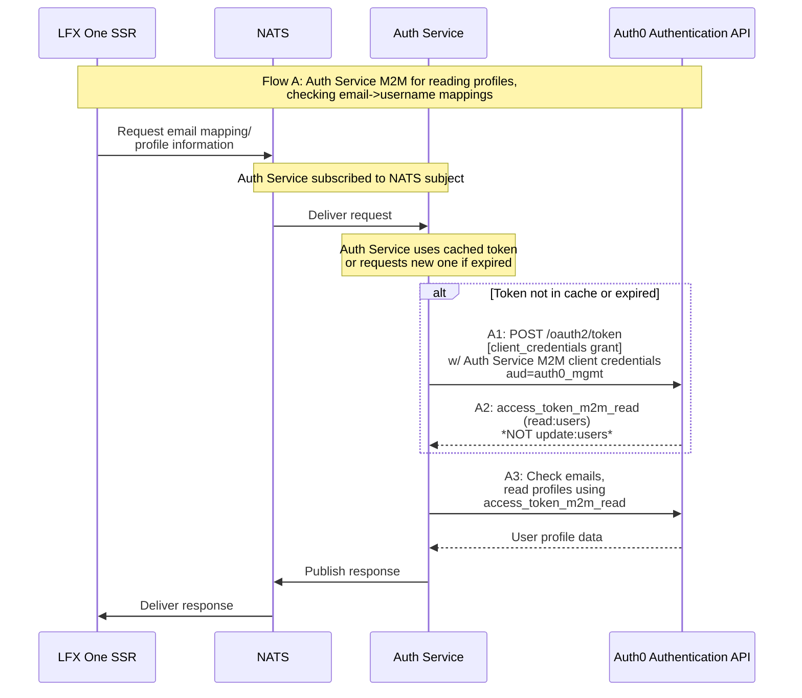

# Flow A: Auth Service M2M Sequence Diagram

## Description
Auth Service M2M for reading profiles and checking email->username mappings.

## Sequence Diagram

```mermaid
sequenceDiagram
    participant SSR as LFX One SSR
    participant NATS as NATS
    participant AuthSvc as Auth Service
    participant Auth0 as Auth0 Authentication API

    Note over SSR,Auth0: Flow A: Auth Service M2M for reading profiles,<br/>checking email->username mappings

    SSR->>NATS: Request email mapping/<br/>profile information
    Note over NATS,AuthSvc: Auth Service subscribed to NATS subject
    NATS->>AuthSvc: Deliver request

    Note over AuthSvc: Auth Service uses cached token<br/>or requests new one if expired

    alt Token not in cache or expired
        AuthSvc->>Auth0: A1: POST /oauth2/token<br/>[client_credentials grant]<br/>w/ Auth Service M2M client credentials<br/>aud=auth0_mgmt

        Auth0-->>AuthSvc: A2: access_token_m2m_read<br/>(read:users)<br/>*NOT update:users*
    end

    AuthSvc->>Auth0: A3: Check emails,<br/>read profiles using<br/>access_token_m2m_read

    Auth0-->>AuthSvc: User profile data
    AuthSvc->>NATS: Publish response
    NATS->>SSR: Deliver response
```