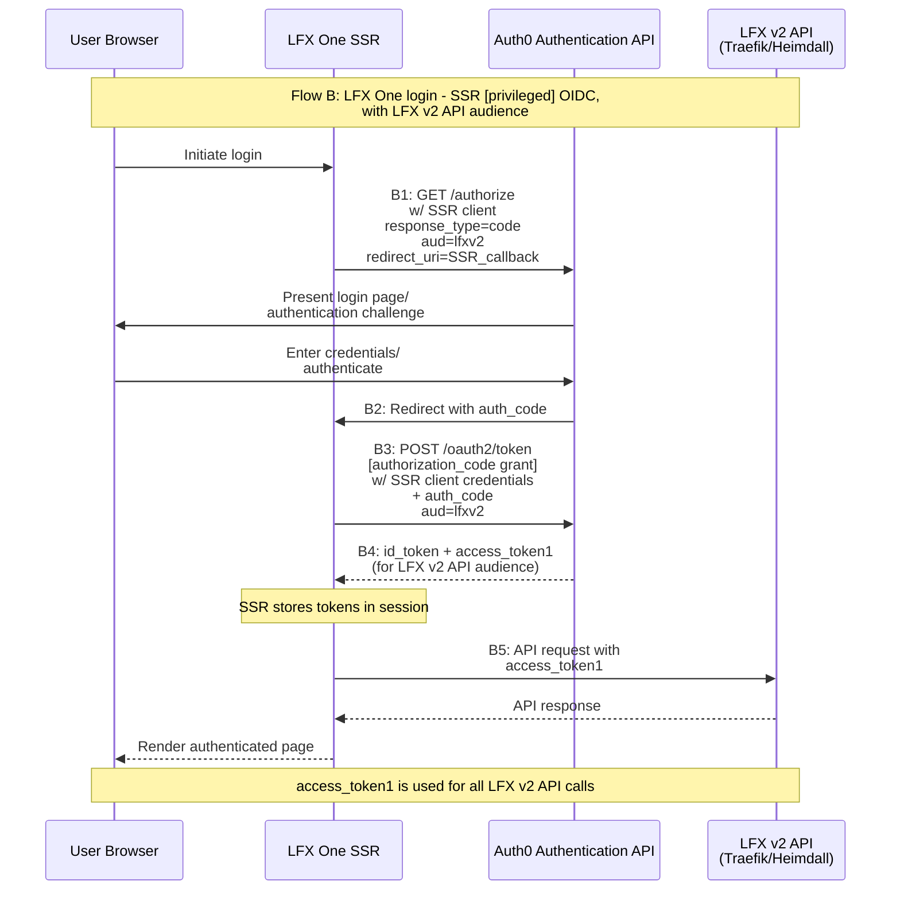

# Flow B: LFX One Login SSR OIDC Sequence Diagram

## Description
LFX One login using SSR (server-side rendering) with privileged OIDC flow. This flow authenticates the user and obtains access tokens for the LFX v2 API (Traefik/Heimdall).

## Sequence Diagram

