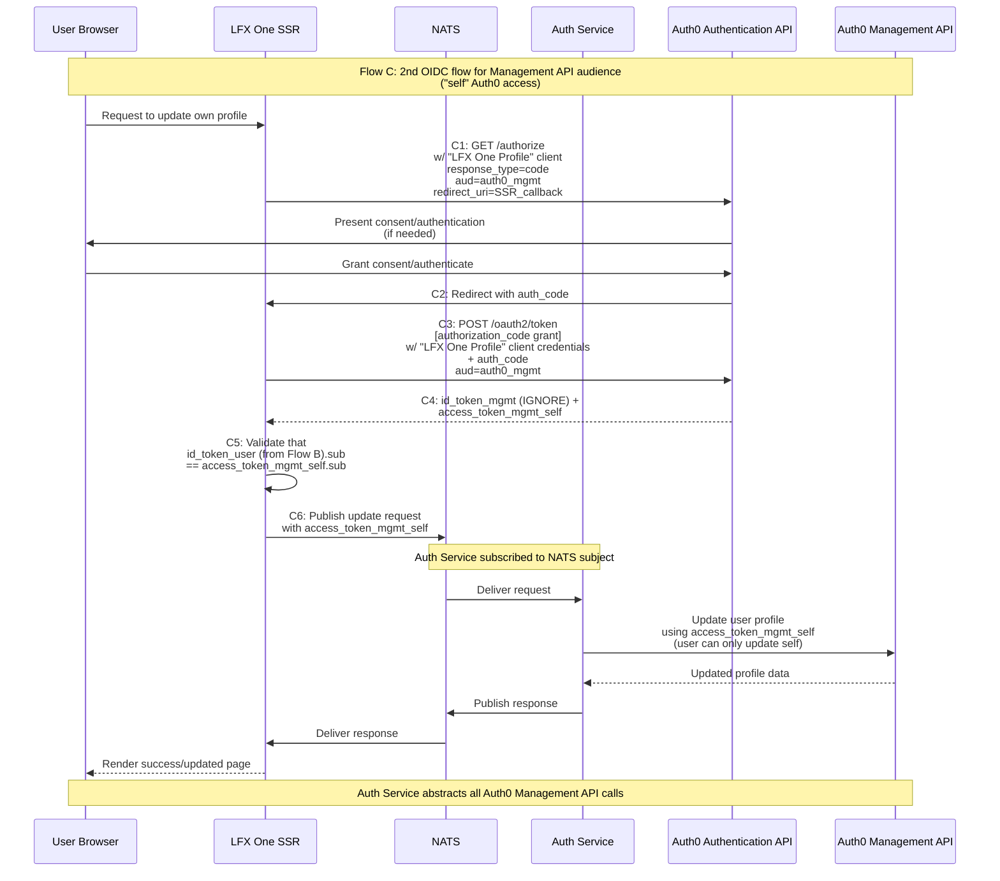

# Flow C: Self-Service Profile Update via SPA OIDC for Management API audience ('self' Auth0 access)

## Description
OpenID Connect (OIDC) flow for the Auth0 Management API audience, allowing users to manage their own profiles (“self” Auth0 access). This flow shares the same client used by Flow D’s SPA client.

## Sequence Diagram

