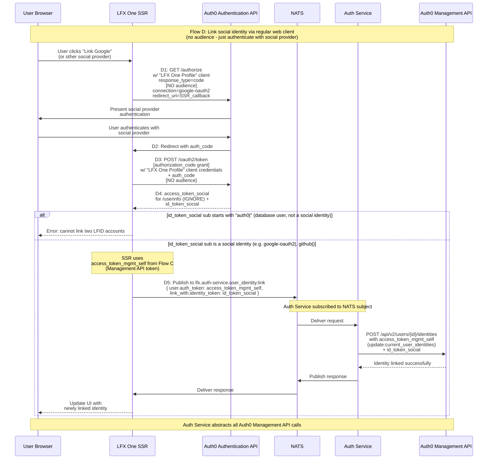

# Flow D: Link Social Identity via Regular Web Client (No Audience)

## Description
Regular web client flow for linking social identities by authenticating with the social provider. Uses the LFX One Profile Client and access_token_mgmt_self from Flow C (Management API token) to perform the actual linking operation. This flow uses server-side redirects instead of popup/webmessage pattern.

## Sequence Diagram

