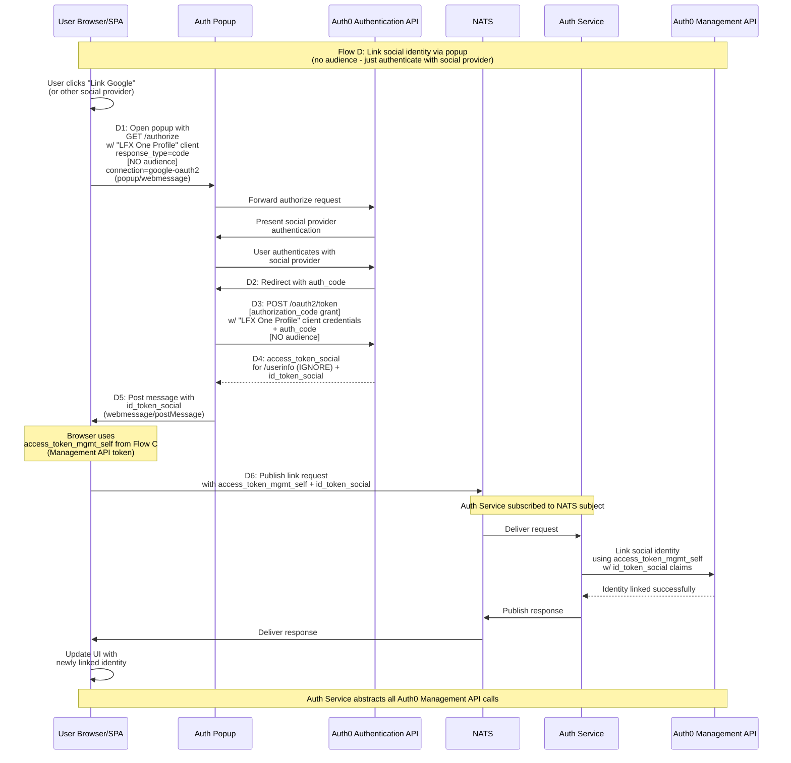

# Flow D: Link Social Identity via Popup/WebMessage (No Audience)

## Description
SPA flow for linking social identities by authenticating with the social provider in a popup. Uses access_token2 from Flow C (Management API token) to perform the actual linking operation.

## Sequence Diagram

