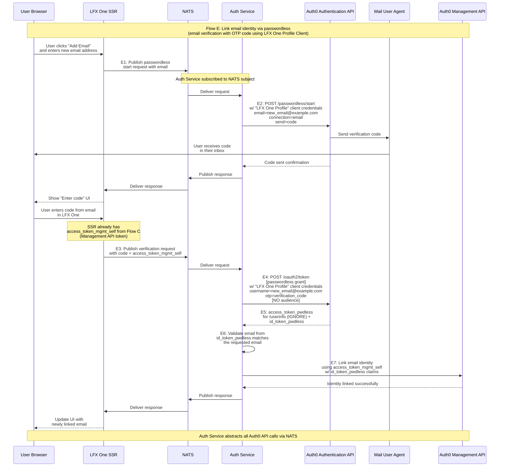

# Flow E: Link Email Identity via Passwordless

## Description
SSR flow for linking additional email addresses to a user's account using passwordless authentication. Uses the LFX One Profile Client for the passwordless OTP flow. All Auth0 API calls (both passwordless and Management API) are made by Auth Service, with SSR communicating via NATS pub/sub pattern. Uses access_token_mgmt_self from Flow C (Management API token) to perform the actual linking operation. The user verifies ownership of the email by entering a one-time verification code in LFX One.

## Sequence Diagram

